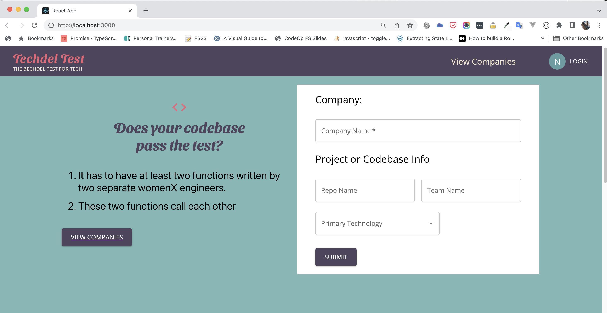

<!-- Improved compatibility of back to top link: See: https://github.com/othneildrew/Best-README-Template/pull/73 -->

<a name="readme-top"></a>

<!-- PROJECT SHIELDS -->
<!--
*** I'm using markdown "reference style" links for readability.
*** Reference links are enclosed in brackets [ ] instead of parentheses ( ).
*** See the bottom of this document for the declaration of the reference variables
*** for contributors-url, forks-url, etc. This is an optional, concise syntax you may use.
*** https://www.markdownguide.org/basic-syntax/#reference-style-links
-->

[![Contributors][contributors-shield]][contributors-url]
[![Forks][forks-shield]][forks-url]
[![Stargazers][stars-shield]][stars-url]
[![Issues][issues-shield]][issues-url]
[![MIT License][license-shield]][license-url]
[![LinkedIn][linkedin-shield]][linkedin-url]

<!-- PROJECT LOGO -->
<br />
<div align="center">

<h3 align="center">Techdel Test</h3>

  <p align="center">
    A web application used to track the codebases or projects that pass the Techdel Test. 
    
    The Techdel Test is based off of the Bechdel Test, or Bechdel-Wallace Test, which is a simple test which names the following three criteria: (1) it has to have at least two women in it, who (2) who talk to each other, about (3) something besides a man.

    A Techdel Test, is a method of measuring the influence and impact that folks who identify as womenX have on a codebase. To pass the test, (1) Two separate womenX engineers have to write to different functions or methods in production code. (2) These functions or methods call each other

<!--
    <br />
    <a href="https://github.com/github_username/repo_name"><strong>Explore the docs »</strong></a>
    <br />
    <br />
    <a href="https://github.com/github_username/repo_name">View Demo</a>
    ·
    <a href="https://github.com/github_username/repo_name/issues">Report Bug</a>
    ·
    <a href="https://github.com/github_username/repo_name/issues">Request Feature</a> -->

  </p>
</div>

<!-- TABLE OF CONTENTS -->
<details>
  <summary>Table of Contents</summary>
  <ol>
    <li>
      <a href="#about-the-project">About The Project</a>
      <ul>
        <li><a href="#built-with">Built With</a></li>
      </ul>
    </li>
    <li>
      <a href="#getting-started">Getting Started</a>
      <ul>
        <li><a href="#prerequisites">Prerequisites</a></li>
        <li><a href="#database-prep">Database Prep</a></li>
        <li><a href="#run-development-servers">Run Development Servers</a></li>
      </ul>
    </li>
    <li><a href="#usage">Usage</a></li>
    <li><a href="#roadmap">Roadmap</a></li>
    <li><a href="#contributing">Contributing</a></li>
    <li><a href="#license">License</a></li>
    <li><a href="#contact">Contact</a></li>
    <li><a href="#acknowledgments">Acknowledgments</a></li>
  </ol>
</details>

<!-- ABOUT THE PROJECT -->

## About The Project



<p align="right">(<a href="#readme-top">back to top</a>)</p>

### Built With


<p align="right">(<a href="#readme-top">back to top</a>)</p>

<!-- GETTING STARTED -->

## Getting Started

This is an example of how you may give instructions on setting up your project locally.
To get a local copy up and running follow these simple example steps.

### Prerequisites

1. Clone the repo
   ```sh
   git clone https://github.com/aharmo3/techdel
   ```
2. Install Server NPM packages
   ```sh
   npm install
   ```
3. Install Client NPM packages
   ```sh
   cd client && npm install
   ```

### Database Prep

Create `.env` file in project directory and add

```
DB_NAME=techdel
DB_PASS=YOUR_PASSWORD
```

(replace `YOUR_PASSWORD` with your actual password)

In the MySQL CLI, type `create database techdel;` to create a database in MySQL.

Run `node model/database.js` in your **TERMINAL**, in the **project** folder (not your MySQL CLI! Open a new terminal window for this). This will create a table called 'company' and 'repo' in your database.

#### Run Development Servers

- Run `npm start` in project directory to start the Express server on port 3000
- `cd client` and run `npm start` to start client server in development mode with hot reloading in port 3000.
- Client is configured so all API calls will be proxied to port 3000 for a smoother development experience. Yay!
- You can test your client app in `http://localhost:3000`
- You can test your API in `http://localhost:3000/api`

<p align="right">(<a href="#readme-top">back to top</a>)</p>

<!-- USAGE EXAMPLES -->

<!-- ROADMAP -->

## Roadmap

- [ ] Add support for a dynamic scoring system
- [ ] Add support for public repositories on github
- [ ] Add markdown badge that codeowners can show on their readme
- [ ] Comments on a repo or company
- [ ] Ability to Login / Logout
- [ ] Ability to update status of company on a list
- [ ] Add additional company information from Crunchbase API

See the [open issues](https://github.com/github_username/repo_name/issues) for a full list of proposed features (and known issues).

<p align="right">(<a href="#readme-top">back to top</a>)</p>

<!-- CONTRIBUTING -->

## Contributing

Contributions are what make the open source community such an amazing place to learn, inspire, and create. Any contributions you make are **greatly appreciated**.

If you have a suggestion that would make this better, please fork the repo and create a pull request. You can also simply open an issue with the tag "enhancement".
Don't forget to give the project a star! Thanks again!

1. Fork the Project
2. Create your Feature Branch (`git checkout -b feature/AmazingFeature`)
3. Commit your Changes (`git commit -m 'Add some AmazingFeature'`)
4. Push to the Branch (`git push origin feature/AmazingFeature`)
5. Open a Pull Request

<p align="right">(<a href="#readme-top">back to top</a>)</p>

<!-- LICENSE -->

## License

Distributed under the MIT License. See `LICENSE.txt` for more information.

<p align="right">(<a href="#readme-top">back to top</a>)</p>

CONTACT

## Contact

Amber J Harmon - [@twitter_handle](https://twitter.com/amberjharmon) - aharmo3@gmail.com

Project Link: [https://github.com/aharmo3/techdel](https://github.com/aharmo3/techdel)

<p align="right">(<a href="#readme-top">back to top</a>)</p>

<!-- ACKNOWLEDGMENTS -->

## Acknowledgments

- []()
- []()
- []()

<p align="right">(<a href="#readme-top">back to top</a>)</p>
